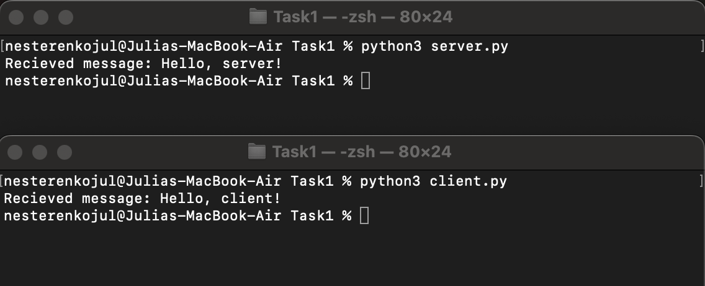
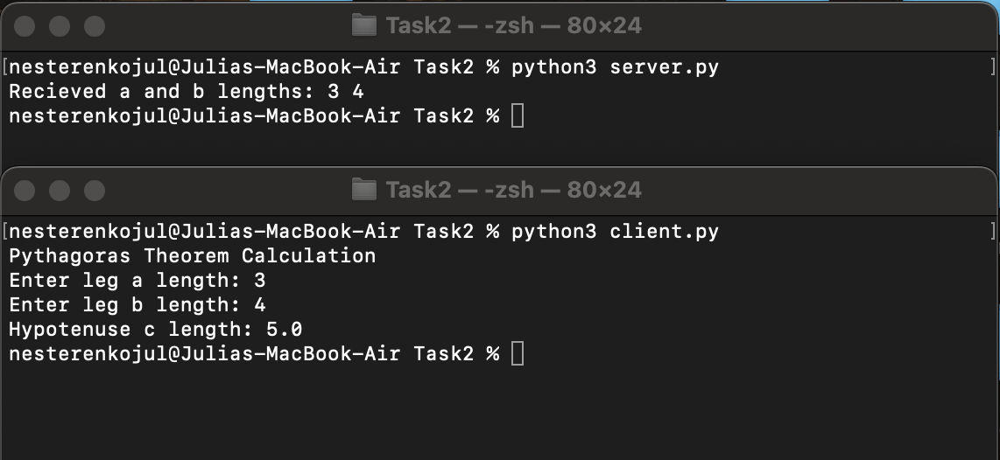

# ЛP 1. Работа с сокетами

 
 

## Практическое задание 1

Реализовать клиентскую и серверную часть приложения. Клиент отсылает серверу
сообщение «Hello, server». Сообщение должно отразиться на стороне сервера.
Сервер в ответ отсылает клиенту сообщение «Hello, client». Сообщение должно
отобразиться у клиента. Обязательно использовать библиотеку socket. Реализовать с помощью протокола UDP.
 
 

**server.py**

    import socket 

    # создаем сокет с семейством адресов IPv4 и использующим протокол UDP
    sock = socket.socket(socket.AF_INET, socket.SOCK_DGRAM)
    sock.bind(("127.0.0.1", 20000))    # связываем сокет с хостом и портом
    data, addr = sock.recvfrom(2048)    # получаем n байт данных от клиента
    decoded_data = data.decode("utf-8")    # декодируем полученные данные
    print("Recieved message:", decoded_data)
    sock.sendto(b"Hello, client!", addr)    # посылаем ответ клиенту
    sock.close()
 

**client.py**

    import socket

    sock = socket.socket(socket.AF_INET, socket.SOCK_DGRAM)
    sock.connect(("127.0.0.1", 20000))  # подключаемся к сокету по указанному адресу
    sock.send(b"Hello, server!")    # отправляем сообщение серверу
    data = sock.recv(2048)    # получаем n байт данных от сервера
    decoded_data = data.decode("utf-8")    # декодируем полученные данные
    print("Recieved message:", decoded_data)
    sock.close()
 

**Запуск**

 
 

## Практическое задание 2

Реализовать клиентскую и серверную часть приложения. Клиент запрашивает у
сервера выполнение математической операции, параметры, которые вводятся с
клавиатуры. Сервер обрабатывает полученные данные и возвращает результат
клиенту. Вариант - a) Теорема Пифагора. Обязательно использовать библиотеку socket. 
Реализовать с помощью протокола UDP.
 
 

**server.py**

    import socket
    
    
    def calculate_hypotenuse(pair):
        a, b = map(int, pair.split(' '))
        c = (a**2 + b**2)**(1/2)
        return str(c)
    
    
    # создаем сокет с семейством адресов IPv4 и использующим протокол TCP
    sock = socket.socket(socket.AF_INET, socket.SOCK_STREAM)
    sock.bind(("127.0.0.1", 20000))    # связываем сокет с хостом и портом
    sock.listen()
    connection, address = sock.accept()
    data = connection.recv(2048)    # получаем n байт данных от клиента
    decoded_data = data.decode("utf-8")    # декодируем полученные данные
    print("Recieved a and b lengths:", decoded_data)
    reply = calculate_hypotenuse(decoded_data).encode("utf-8")
    connection.send(reply)    # посылаем ответ клиенту
    connection.close()
 

**client.py**

    import socket
    
    
    print("Pythagoras Theorem Calculation")
    a, b = input("Enter leg a length: "), input("Enter leg b length: ")
    if (a + b).isdigit():
        msg = (a + " " + b).encode("utf-8")
    else:
        raise ValueError("Triangle legs lengths must be positive integers")
    
    sock = socket.socket(socket.AF_INET, socket.SOCK_STREAM)
    sock.connect(("127.0.0.1", 20000))  # подключаемся к сокету по указанному адресу
    sock.send(msg)    # отправляем сообщение серверу
    data = sock.recv(2048)    # получаем n байт данных от сервера
    decoded_data = data.decode("utf-8")    # декодируем полученные данные
    print("Hypotenuse c length:", decoded_data)
    sock.close()
 

**Запуск**

 
 

## Практическое задание 3

Реализовать серверную часть приложения. Клиент подключается к серверу. В ответ
клиент получает http-сообщение, содержащее html-страницу, которую сервер
подгружает из файла index.html. Обязательно использовать библиотеку socket. 
Реализовать с помощью протокола UDP.
 
 

**server.py**

    import socket
    
    
    # создаем сокет с семейством адресов IPv4 и использующим протокол TCP
    sock = socket.socket(socket.AF_INET, socket.SOCK_STREAM)
    sock.bind(("127.0.0.1", 20000))    # связываем сокет с хостом и портом
    sock.listen()
    while True:
        connection, address = sock.accept()
        print("Connected to the client at", address)
        data = connection.recv(2048)    # получаем n байт данных от клиента
        decoded_data = data.decode("utf-8")    # декодируем полученные данные
        print("Recieved message from client:", decoded_data)
        with open("index.html") as index:
            starting_line = "HTTP/1.1 200 OK \n"
            headers = "Content-Type: text/html \n\n"
            message_body = index.read()
            response = (starting_line + headers + message_body).encode("utf-8")
        connection.send(response)    # посылаем ответ клиенту
        connection.close()
 

**Запуск**

 
 

## Практическое задание 4

Реализовать двухпользовательский или многопользовательский чат. Реализация
многопользовательского часа позволяет получить максимальное количество
баллов. Реализовать с помощью протокола TCP.
Обязательно использовать библиотеку threading.
Для применения с TCP необходимо запускать клиентские подключения И прием
и отправку сообщений всем юзерам на сервере в потоках. Не забудьте сохранять юзеров,
чтобы потом отправлять им сообщения.
 
 

**server.py**

    import socket
    from threading import Thread
    
    
    #   рассылка сообщений всем клиентам
    def send_all(msg):
        global clients
        for client in clients:
            client.send(msg.encode("utf-8"))
    
    
    #   обработка сообщений одного клиента
    def handle(client):
        global clients
        while True:
            try:
                data = client.recv(2048)
                if not data:
                    raise Exception
                message = clients[client] + ': ' + data.decode("utf-8")
                send_all(message)
                print(message)
            except:
                name = clients[client]
                del clients[client]
                client.close()
                send_all(f"{name} has left the chat")
                print(f"{name} disconnected")
                break
    
    
    #   первичное соединение с клиентом
    def connect():
        global clients
        while True:
            client, address = sock.accept()
            print(f"Connected to a client at {address}")
    
            client.send(b'nickname')
            data = client.recv(2048)
            name = data.decode('utf-8')
            clients[client] = name
            print(f"Client at {address} has set a nickname: {name}")
            send_all(f"{name} has joined the chat")
            th = Thread(target=handle, args=(client,))
            th.start()
    
    
    clients = dict()
    sock = socket.socket(socket.AF_INET, socket.SOCK_STREAM)
    sock.bind(("127.0.0.1", 20000))
    sock.listen()
    
    print("Chat server\nWaiting for users...")
    connect()

 

**client.py**

    import socket
    from threading import Thread
    
    
    #   получение сообщений
    def receive():
        while True:
            try:
                data = sock.recv(2048)
                message = data.decode("utf-8")
                if message == 'nickname':
                    sock.send(name.encode("utf-8"))
                else:
                    print(message)
            except:
                print(f"Oops! An error occurred. Try again later")
                sock.close()
                break
    
    
    #   отправка сообщений
    def respond():
        while True:
            try:
                message = input()
                sock.send(message.encode("utf-8"))
            except Exception as e:
                print(f"Oops! An error occurred. Try again later\nError details: {e}")
                sock.close()
                break
    
    
    sock = socket.socket(socket.AF_INET, socket.SOCK_STREAM)
    sock.connect(("127.0.0.1", 20000))
    
    name = input("Welcome to the chat.\nEnter your nickname: ")
    
    receive_th = Thread(target=receive)
    receive_th.start()
    respond_th = Thread(target=respond)
    respond_th.start()
 

**Запуск**

 
 

## Практическое задание 5

Необходимо написать простой web-сервер для обработки GET и POST http
запросов средствами Python и библиотеки socket.
Задание - сделать сервер, который может:
* Принять и записать информацию о дисциплине и оценке по дисциплине.
* Отдать информацию обо всех оценах по дсициплине в виде html-страницы.
 
 

**server.py**

    import socket
    import sys
    
    
    MAX_LINE = 64*1024
    MAX_HEADERS = 100
    
    
    class Request:
        def __init__(self, method, url, version, headers, rfile):
            self.method = method
            self.url = url
            self.version = version
            self.headers = headers
            self.rfile = rfile
            self.body = self.set_body()
    
        def set_body(self):
            try:
                size = int(self.headers.get('Content-Length'))
            except:
                return
            body = self.rfile.read(size)
            return str(body, 'iso-8859-1').strip()
    
        @property
        def path(self):
            return self.url.split('?')[0] if '?' in self.url else self.url
    
        @property
        def query(self):
            if self.method == 'GET':
                query_string = self.url.split('?')[1] if '?' in self.url else None
            else:
                query_string = self.body
            if not query_string:
                return
            query_list = query_string.split('&') if '&' in query_string else [query_string]
            query_pairs = [tuple(x.split('=')) for x in query_list]
            return {key: val for key, val in query_pairs}
    
    
    class Response:
        def __init__(self, status, reason, headers=None, body=None):
            self.status = status
            self.reason = reason
            self.headers = headers
            self.body = body
    
    
    class MyHTTPServer:
        # Параметры сервера
        def __init__(self, host, port, server_name):
            self._host = host
            self._port = port
            self._server_name = server_name
            self._subjects = {}
    
        # 1. Запуск сервера на сокете, обработка входящих соединений
        def serve_forever(self):
            print("Server running...")
            serv_sock = socket.socket(
                socket.AF_INET,
                socket.SOCK_STREAM)
    
            try:
                serv_sock.bind((self._host, self._port))
                serv_sock.listen()
                while True:
                    conn, addr = serv_sock.accept()
                    print(f"Connected to a client at {addr}")
                    try:
                        self.serve_client(conn)
                    except Exception as e:
                        print('Client serving failed.\nDetails:', e)
            finally:
                serv_sock.close()
    
        # 2. Обработка клиентского подключения
        def serve_client(self, conn):
            try:
                req = self.parse_request(conn)
                resp = self.handle_request(req)
                self.send_response(conn, resp)
            except ConnectionResetError:
                conn = None
            except Exception as e:
                status = 500
                reason = b'Internal Server Error'
                body = str(e).encode('utf-8')
                resp = Response(status, reason,
                                [('Content-Length', len(body))],
                                body)
                self.send_response(conn, resp)
    
            if conn:
                conn.close()
    
        # 3. функция для обработки заголовка http+запроса.
        # Python, сокет предоставляет возможность создать вокруг него некоторую обертку,
        # которая предоставляет file object интерфейс. Это дайте возможность построчно обработать запрос.
        # Заголовок всегда - первая строка.
        # Первую строку нужно разбить на 3 элемента  (метод + url + версия протокола).
        # URL необходимо разбить на адрес и параметры
        # (isu.ifmo.ru/pls/apex/f?p=2143 , где isu.ifmo.ru/pls/apex/f, а p=2143 - параметр p со значением 2143)
        def parse_request(self, conn):
            rfile = conn.makefile('rb')
    
            raw = rfile.readline(MAX_LINE + 1)  # cчитываем первую строку (status line)
            if len(raw) > MAX_LINE:
                raise Exception('Request line is too long')
            req_line = str(raw, 'iso-8859-1').rstrip('\r\n')
    
            words = req_line.split()
            if len(words) != 3:  # должно быть 3 части через пробел
                raise Exception('Incorrect request line')
            method, url, version = words
            print('Received request: ', *words)
            if version != 'HTTP/1.1':
                raise Exception('Unexpected HTTP version')
    
            headers = self.parse_headers(rfile)
            host = headers.get('Host')
            if not host:
                raise Exception('Bad request')
    
            return Request(method, url, version, headers, rfile)
    
    
        # 4. Функция для обработки headers.
        # Необходимо прочитать все заголовки после первой строки до появления пустой строки и сохранить их в массив.
        def parse_headers(self, rfile):
            headers = []
            while True:
                line = rfile.readline(MAX_LINE + 1)
                if len(line) > MAX_LINE:
                    raise Exception('Header line is too long')
    
                if line in (b'\r\n', b'\n', b''): # секция заголовков заканчивается пустой строкой
                    break
    
                headers.append(line.strip())
                if len(headers) > MAX_HEADERS:
                    raise Exception('Too many headers')
            decoded_headers = [tuple(header.decode('iso-8859-1').split(': ')) for header in headers]
            headers_dict = dict(decoded_headers)
            print('With headers: ', headers_dict)
            return headers_dict
    
    
        # 5. Функция для обработки url в соответствии с нужным методом.
        # В случае данной работы, нужно будет создать набор условий, который обрабатывает GET или POST запрос.
        # GET запрос должен возвращать данные. POST запрос должен записывать данные на основе переданных параметров.
        def handle_request(self, req):
            if req.path == '/':
                contentType = 'text/html; charset=utf-8'
                with open("index.html") as index:
                    body = index.read()
                body = body.encode('utf-8')
                print('Formed GET-response with body: ', body)
                headers = [('Content-Type', contentType),
                           ('Content-Length', len(body))]
                return Response(200, 'OK', headers, body)
    
            if req.path == '/grades' and req.method == 'POST':
                subject = req.query['subject']
                grade = req.query['grade']
                print(subject, grade)
                if subject in self._subjects:
                    self._subjects[subject].append(grade)
                else:
                    self._subjects[subject] = [grade]
                contentType = 'text/html; charset=utf-8'
                body = '<html><head></head><body>'
                body += f'<h3>Grade {grade} for subject {subject} is registered.</h3>'
                body += ' <a href="/">Return to main page</a>'
                body += '</body></html>'
                body = body.encode('utf-8')
                print('Formed POST-response with body: ', body)
                headers = [('Content-Type', contentType),
                           ('Content-Length', len(body))]
                return Response(200, 'Grade added', headers, body)
    
            if req.path == '/grades' and req.method == 'GET':
                subject = req.query['subject']
                contentType = 'text/html; charset=utf-8'
                body = '<html><head></head><body>'
                body += f'<h3>Grades for subject {subject}</h3>'
                body += '<ul>'
                if subject in self._subjects.keys():
                    for grade in self._subjects[subject]:
                        body += f'<li>{grade}</li>'
                else:
                    body += f'<li>No grades yet</li>'
                body += '</ul>'
                body += ' <a href="/">Return to main page</a>'
                body += '</body></html>'
                body = body.encode('utf-8')
                print('Formed GET-response with body: ', body)
                headers = [('Content-Type', contentType),
                           ('Content-Length', len(body))]
                return Response(200, 'OK', headers, body)
    
            raise Exception('Not found')
    
    
        # 6. Функция для отправки ответа.
        # Необходимо записать в соединение status line вида HTTP/1.1 <status_code> <reason>.
        # Затем, построчно записать заголовки и пустую строку, обозначающую конец секции заголовков.
        def send_response(self, conn, resp):
            wfile = conn.makefile('wb')
            status_line = f'HTTP/1.1 {resp.status} {resp.reason}\r\n'
            wfile.write(status_line.encode('iso-8859-1'))
    
            if resp.headers:
                for key, value in resp.headers:
                    header_line = f'{key}: {value}\r\n'
                    wfile.write(header_line.encode('iso-8859-1'))
    
            wfile.write(b'\r\n')
    
            if resp.body:
                wfile.write(resp.body)
    
            wfile.flush()
            wfile.close()
            print('Response sent\n')
    
    
    if __name__ == '__main__':
        host = sys.argv[1]
        port = int(sys.argv[2])
        name = sys.argv[3]
        serv = MyHTTPServer(host, port, name)
        try:
            serv.serve_forever()
        except KeyboardInterrupt:
            pass
 

**Запуск**

 
 

## Выводы

В рамках данной лабораторной работы были получены навыки реализации web-серверов и
использования сокетов при помощи языка программирования Python. 
Я освежила знания о модели клиент-серверного взаимодействия. 
Познакомилась с библиотеками socket и threading 
и со стоящими за ними концепциями сокетов и потоков. 
Разобралась со структурой HTTP-запроса, его функцией 
и процессами его формирования и обработки.
Полученные знания можно применять как и для создания собственных веб-приложений,
так и для общего понимания, что происходит, когда мы пользуемся интернетом 
и, например, самостоятельного устранения возникающих  ошибок.