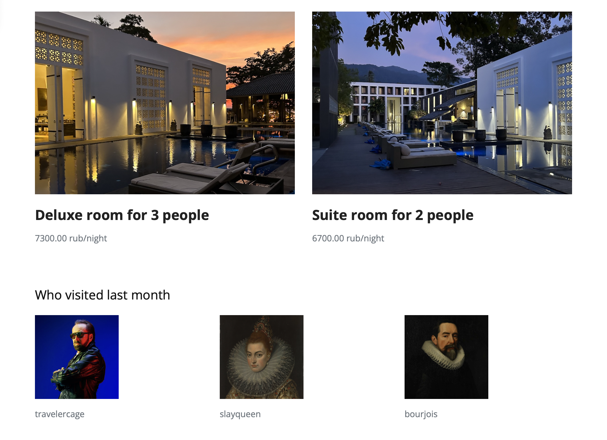

# ЛP 2. Реализация простого сайта средствами Django

 
 

## Вариант 1. Список отелей

Необходимо учитывать название отеля, владельца отеля, адрес, описание, типы
номеров, стоимость, вместимость, удобства.
Необходимо реализовать следующий функционал:
- Регистрация новых пользователей.
- Просмотр и резервирование номеров. Пользователь должен иметь
возможность редактирования и удаления своих резервирований.
- Написание отзывов к номерам. При добавлении комментариев, должны
сохраняться период проживания, текст комментария, рейтинг (1-10),
информация о комментаторе.
- Администратор должен иметь возможность заселить пользователя в отель и
выселить из отеля средствами Django-admin.
- В клиентской части должна формироваться таблица, отображающая
постояльцев отеля за последний месяц.
 
 

## Описание моделей (models.py)

**Пользователь (Гость)** - основан на абстрактной модели базового пользователя Django.

    class Guest(AbstractUser):
        country = models.CharField(max_length=30)
        photo = models.ImageField(blank=True, default='user.svg')
    
        REQUIRED_FIELDS = []
        objects = GuestManager()
    
        @property
        def bookings(self):
            return Booking.objects.filter(guest=self)
 

**Отель**

    class Hotel(models.Model):
        name = models.CharField(max_length=100)
        owner = models.CharField(max_length=50)
        location = models.CharField(max_length=100)
        thumbnail = models.ImageField()
        description = models.TextField(blank=True, null=True)
    
        @property
        def rooms(self):
            return Room.objects.filter(hotel=self)
    
        @property
        def guests(self):
            guestlist = []
            for room in self.rooms:
                guestlist.extend(room.get_last_month_guests())
            return list(set(guestlist))
 

**Комната** - имеет внешний ключ, относящийся к Отелю.

    class Room(models.Model):
        type_CH = ('Apartment', 'Dormitory', 'Standard', 'Suite', 'Deluxe', 'Superior')
        type = models.CharField(choices=zip(type_CH, type_CH), max_length=10)
        hotel = models.ForeignKey(Hotel, on_delete=models.CASCADE)
        capacity = models.PositiveSmallIntegerField(validators=(MinValueValidator(1), MaxValueValidator(10)))
        thumbnail = models.ImageField()
        comm_CH = ('Bathroom', 'Swimming pool', 'Parking',
                   'Wi-Fi', 'Air conditioner', 'Room service',
                   'Breakfast', 'Balcony', 'Refrigerator')
        commodities = MultiSelectField(choices=zip(comm_CH, comm_CH), max_choices=9, max_length=300)
        price = models.DecimalField(decimal_places=2, max_digits=8, validators=[MinValueValidator(0)])
    
        @property
        def reviews(self):
            bookings = Booking.objects.filter(room=self)
            return Review.objects.filter(booking__in=bookings)
    
        def available(self, start, end):
            start = datetime.date.fromisoformat(start)
            end = datetime.date.fromisoformat(end)
            bookings = (Booking.objects.filter(room=self, status='Active') |
                        Booking.objects.filter(room=self, status='Awaits'))
            for book in bookings:
                if ((start <= book.date_from and end >= book.date_until) or
                        (book.date_from <= start <= book.date_until) or
                        (book.date_from <= end <= book.date_until)):
                    return False
            return True
    
        def get_last_month_guests(self):
            today = datetime.date.today()
            month_before = today - datetime.timedelta(days=30)
            bookings = Booking.objects.filter(room=self, date_until__range=[month_before, today])
            return [b.guest for b in bookings]
 

**Бронирование** - имеет внешние ключи, относящиеся к Гостю и Комнате.

    class Booking(models.Model):
        guest = models.ForeignKey(get_user_model(), on_delete=models.CASCADE)
        room = models.ForeignKey(Room, on_delete=models.CASCADE)
        status_CH = ('Active', 'Awaits', 'Finished', 'Canceled')
        status = models.CharField(choices=zip(status_CH, status_CH), max_length=10)
        date_from = models.DateField()
        date_until = models.DateField()
    
        @property
        def total_price(self):
            days = (self.date_until - self.date_from).days
            days = days if days != 0 else 1
            return self.room.price * days
 

**Отзыв** - имеет внешний ключ, относящийся к Бронированию.

    class Review(models.Model):
        booking = models.ForeignKey(Booking, on_delete=models.CASCADE)
        date = models.DateField(auto_now_add=True)
        rating_CH = ('1', '2', '3', '4', '5')
        rating = models.CharField(choices=zip(rating_CH, rating_CH), max_length=1)
        body = models.TextField()

 
 

## Описание контроллеров (views.py)

**index** - рендерит основную страницу со списком всех отелей.

    def index(request):
        try:
            h = Hotel.objects.order_by('name')
        except Hotel.DoesNotExist:
            raise Http404("No hotels available")
        data = {'hotel_list': h}
        return render(request, 'index.html', data)
 

**hotel** - рендерит страницу отеля с укзанным id.

    def hotel(request, id):
        try:
            h = Hotel.objects.get(pk=id)
        except Hotel.DoesNotExist:
            raise Http404("Cannot find this hotel")
        try:
            rl = Room.objects.filter(hotel=h)
        except Room.DoesNotExist:
            rl = []
        data = {'hotel': h,
                'room_list': rl,
                'guest_list': h.guests}
        return render(request, 'hotel.html', data)
 

**room** - рендерит страницу комнаты с укзанным id (также содержит логику создания бронирования).

    def room(request, id):
    try:
        r = Room.objects.get(pk=id)
    except Room.DoesNotExist:
        raise Http404("Cannot find this room")
    if request.method == 'POST':
        u = request.user
        d_f = request.POST.get('from')
        d_u = request.POST.get('until')
        if d_f > d_u:
            messages.info(request, 'Departure should be later than Arrival')
        elif not r.available(d_f, d_u):
            messages.info(request, 'Room is booked for these days')
        else:
            post_data = {'guest': u, 'room': r, 'date_from': d_f, 'date_until': d_u, 'status': 'Awaits'}
            f = BookingCreationForm(post_data)
            f.save()
            return redirect('/account')

    data = {'room': r}
    return render(request, 'room.html', data)
 

**cancelbooking** - изменение статуса бронирования с укзанным id на "Отменено" (доступ только для авторизированных пользователей).

    @login_required(login_url='login')
    def cancelbooking(request, id):
        try:
            b = Booking.objects.get(pk=id)
        except Booking.DoesNotExist:
            raise Http404("Cannot find this booking")
        if b.guest != request.user:
            raise HttpResponseNotAllowed("Only user who made the booking can cancel it")
        b.status = 'Canceled'
        b.save(update_fields=['status'])
        return redirect('/account')
 

**review** - оставить отзыв на бронирование с укзанным id (доступ только для авторизированных пользователей, кому принадлежит бронирование).

    @login_required(login_url='login')
    def review(request, booking_id):
        try:
            b = Booking.objects.get(pk=booking_id)
        except Booking.DoesNotExist:
            raise Http404("Cannot find this booking")
        if b.guest != request.user:
            raise HttpResponseNotAllowed("Only user who made the booking can review it")
        r = request.POST.get('rating')
        bod = request.POST.get('body')
        post_data = {'booking': b, 'rating': r, 'body': bod}
        f = ReviewCreationForm(post_data)
        f.save()
        return redirect('/account')
 

**register_page** - производит регистрацию пользователя и рендерит ее страницу.

    def register_page(request):
        if request.user.is_authenticated:
            return redirect('/')
        f = GuestCreationForm()
    
        if request.method == 'POST':
            f = GuestCreationForm(request.POST, request.FILES)
            try:
                f.save()
                return redirect('login')
            except ValueError:
                for err in dict(f.errors).values():
                    messages.info(request, err)
    
        data = {'form': f}
        return render(request, 'register.html', data)
 

**login_page** - производит авторизацию пользователя и рендерит ее страницу.

    def login_page(request):
        if request.user.is_authenticated:
            return redirect('/')
    
        if request.method == 'POST':
            u = request.POST.get('username')
            p = request.POST.get('password')
            Guest = get_user_model()
            try:
                user = Guest.objects.get(username=u)
                if check_password(p, user.password) or p == user.password:
                    login(request, user)
                    return redirect('/', user)
                else:
                    messages.info(request, 'Incorrect password')
            except Guest.DoesNotExist:
                messages.info(request, 'Incorrect username')
        return render(request, 'login.html')
 

**logout_user** - производит выход из аккаунта текущего пользователя.

    @login_required(login_url='login')
    def logout_user(request):
        logout(request)
        return redirect('/')
 

**account** - рендерит страницу аккаунта текущего пользователя (доступ только для авторизированных пользователей).

    @login_required(login_url='login')
    def account(request):
        u = request.user
        data = {'user': u}
        return render(request, 'account.html', data)

 
 

## Описание роутеров (urls.py)

Прописаны пути для каждого контроллера из файла views.py. Отдельно прописан путь до директории с медиа файлами (изображениями).

    urlpatterns = [
        path('', views.index),
        path('hotel/<id>/', views.hotel, name='hotel'),
        path('room/<id>/', views.room, name='room'),
        path('cancelbooking/<id>/', views.cancelbooking, name='cancelbooking'),
        path('review/<booking_id>/', views.review, name='review'),
        path('account/', views.account, name='account'),
        path('register/', views.register_page, name='register'),
        path('login/', views.login_page, name='login'),
        path('logout/', views.logout_user, name='logout')
    ] + static(settings.MEDIA_URL, document_root=settings.MEDIA_ROOT)
 

 
 

## Работа программы

**Главная страница**

**Cтраница отеля**

**Cтраница комнаты**

**Cтраница пользователя**

 
 

## Выводы

В рамках данной лабораторной работы были получены навыки работы с веб-фреймворком Django. 
Реализован простой сайт по варианту 1 - Список отелей.
Познакомилась с моделью MVC и ее реализации в Django.  
Разобралась со структурой Django-проекта; как взаимодействуют модели, контроллеры и роутеры.
Дополнительно углубилась в создание user-friendly html-шаблонов для своего приложения.
Полученные знания можно применять для создания собственных веб-приложений на Django.
Более того, понимание модели MVC потенциально упрощает работу и с другими web-фреймворками.