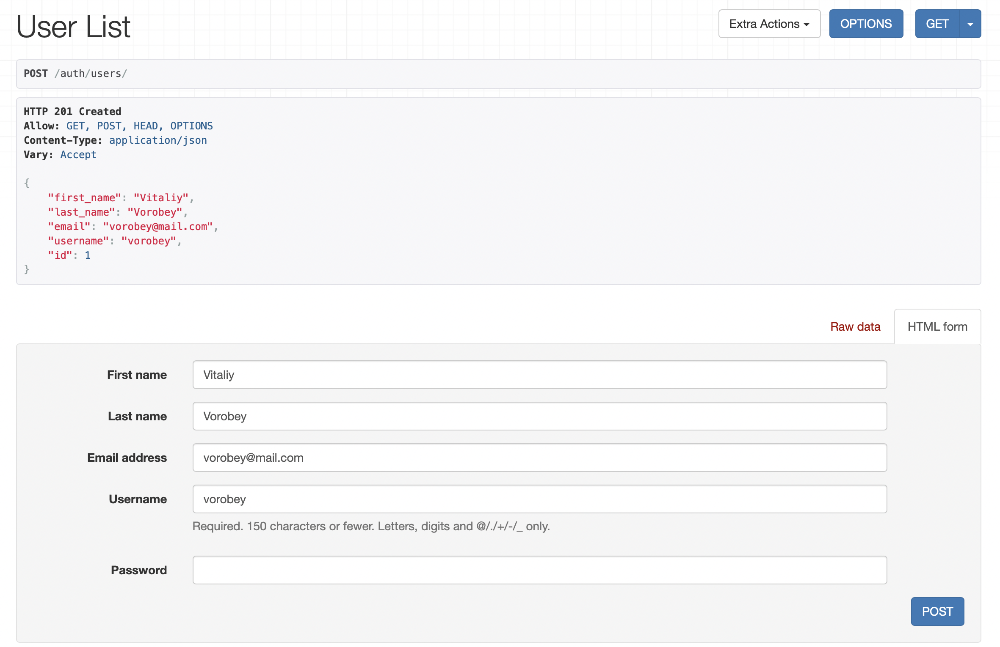
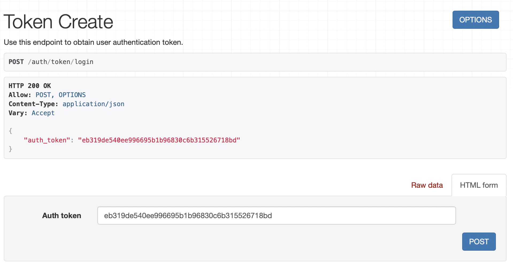

# ЛР 3. Реализация серверной части на django rest. Документирование API.
## Авторизация
<br>
Для доступа к API необходима авторизация с помощью токена.

<br>

### Создание пользователя
POST-запрос по пути:
```
/auth/users
```
Поля в теле запроса:

- `first_name`
- `last_name`
- `email`
- `username`
- `password`



### Получение токена
POST-запрос по пути:
```
/auth/token/login
```
Поля в теле запроса:

- `username`
- `password`



### Использование токена в запросе
Далее во все запросы к API нужно добавить заголовок 
с ключом `Authorization` и значением `Token <current-user-token>`

<br>

### Доступ к текущему аутентифицированному пользователю
GET-запрос по пути:
```
/auth/users/me
```

