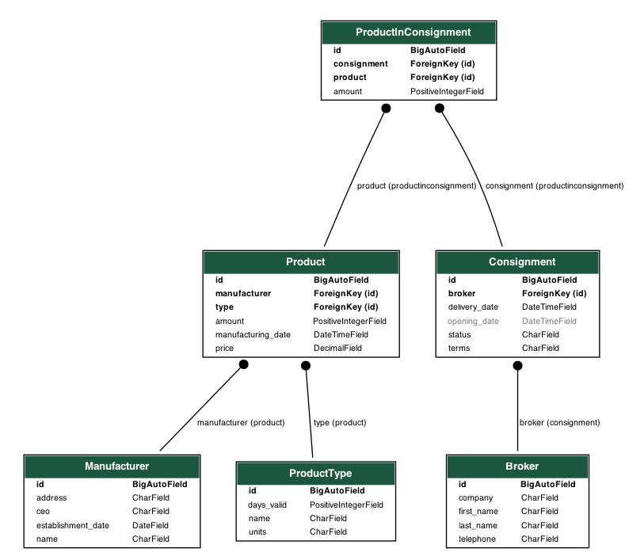

# ЛР 3. Реализация серверной части на django rest. Документирование API.
## Описание
<br>
API пограммной системы, предназначенной для хранения информации о торгах на товарно-сырьевой бирже.

<br>

### Схема базы данных


<br>

### Пути доступа к моделям
По приведенным ниже путям можно получить список всех обьектов модели.

##### Производитель
```
/exchange/manufacturer
```
##### Тип товара
```
/exchange/producttype
```
##### Товар
```
/exchange/product
```
##### Брокер
```
/exchange/broker
```
##### Партия
```
/exchange/consignment
```
##### Товар в партии
```
/exchange/productinconsignment
```
<br>

> Также для каждой модели доступны:
> 
> - создание нового объекта `<modelpath>/create`
> - просмотр одного объекта `<modelpath>/<id>`
> - редактирование объекта `<modelpath>/<id>/edit`
> - удаление объекта `<modelpath>/<id>/delete`

<br>

### Примеры
<br>

##### Список


##### Создание


##### Один объект


##### Редактирование


##### Удаление
