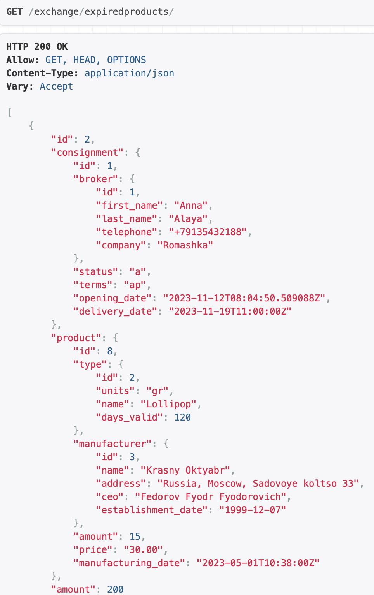

# ЛР 3. Реализация серверной части на django rest. Документирование API.
## Эндпоинты
<br>
Согласно варианту реализованы эндпоинты, соответствующие переченю возможных запросов к базе данных.

<br>

### Сколько единиц товара каждого вида выставлено на продажу от и до заданной даты
GET-запрос должен содержать обязательные параметры:

- `date_from=<YYYY-MM-DD>`
- `date_until=<YYYY-MM-DD>`
```
/exchange/productsbytypeanddate/?date_from=<YYYY-MM-DD>&date_until=<YYYY-MM-DD>
```


### Найти фирму-производителя товаров, которая за заданный период времени выручила максимальную сумму денег
GET-запрос должен содержать обязательные параметры:

- `date_from=<YYYY-MM-DD>`
- `date_until=<YYYY-MM-DD>`
```
/exchange/topmanufacturerbydate/?date_from=<YYYY-MM-DD>&date_until=<YYYY-MM-DD>
```


### Найти товары, которые никогда не выставляли на продажу брокеры заданной конторы
GET-запрос должен содержать обязательный параметр:

- `company=<company-name>`
```
/exchange/productsnotsoldbycompany/?company=<company-name>
```


### Найти все факты выставления на продажу товаров с просроченной годностью
```
/exchange/expiredproducts
```



### Найти зарплату всех брокеров заданной конторы
GET-запрос должен содержать обязательный параметр:

- `company=<company-name>`
```
/exchange/brokersalarybycompany/?company=<company-name>
```
