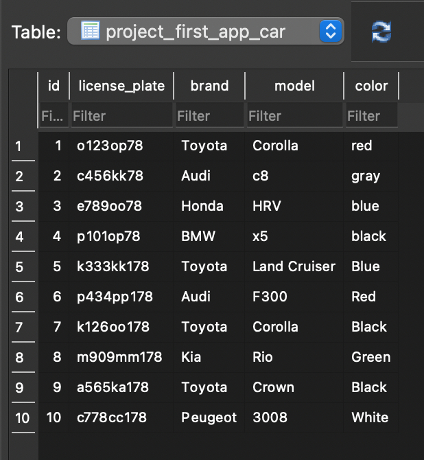

# ПР 3.1. Django Web framework. Запросы и их выполнение.
<br>

## Описание
<br>
Структура базы данных взята из практической работы 2.


В проекте есть соответствующие модели:

**Автомобиль**
```
class Car(models.Model):
    license_plate = models.CharField(max_length=15)
    brand = models.CharField(max_length=20)
    model = models.CharField(max_length=20)
    color = models.CharField(max_length=30, blank=True, null=True)
```

**Автовладелец**
```
class Owner(models.Model):
    last_name = models.CharField(max_length=30)
    first_name = models.CharField(max_length=30)
    birthday = models.DateField(blank=True, null=True)
    owned_cars = models.ManyToManyField(Car, through='Ownership')
```

**Водительское удостоверение**
```
class License(models.Model):
    owner = models.ForeignKey(Owner, on_delete=models.CASCADE, related_name='driver_license')
    number = models.CharField(max_length=10)
    type_CH = ('A', 'B', 'C', 'D', 'E')
    type = models.CharField(choices=zip(type_CH, type_CH), max_length=1)
    issue_date = models.DateField()
```

**Владение автомобилем**
```
class Ownership(models.Model):
    owner = models.ForeignKey(Owner, on_delete=models.CASCADE, related_name='as_car_owner')
    car = models.ForeignKey(Car, on_delete=models.CASCADE)
    date_from = models.DateField()
    date_until = models.DateField(blank=True, null=True)
```
<br><br>

## Задача 1. Создание объектов 
<br>
Напишите запрос на создание 6-7 новых автовладельцев и 5-6 автомобилей, 
каждому автовладельцу назначьте удостоверение и от 1 до 3 автомобилей. 
Задание можете выполнить либо в интерактивном режиме интерпретатора, 
либо в отдельном python-файле. 
Результатом должны стать запросы и отображение созданных объектов. 

<br>

Содержание файла с запросами на добавление
```
import os
import django

os.environ.setdefault('DJANGO_SETTINGS_MODULE', 'django_project_nesterenko.settings')
django.setup()

from datetime import date
from project_first_app.models import *


#   Owners
first_names = ['Anna', 'James', 'Bill', 'Jane', 'Leo', 'Willy']
last_names = ['Pavlova', 'Bond', 'Clinton', 'Austen', 'Tolstoy', 'Wonka']
birthdays = [date(1903, 12, 1), date(1920, 11, 2), date(1948, 3, 15),
             date(1775, 12, 16), date(1850, 2, 24), date(1900, 1, 1)]

#   Licences
numbers = ['9324311290', '8842451291', '0288872181',
           '5369135664', '7458252854', '0929424112']
types = ['C', 'B', 'A', 'B', 'C', 'D']
dates = [date(1930, 1, 1), date(1960, 1, 1), date(1990, 1, 1),
         date(1800, 1, 1), date(1890, 1, 1), date(1920, 1, 1)]

#   Cars
plates = ['k333kk178', 'p434pp178', 'k126oo178',
          'm909mm178', 'a565ka178', 'c778cc178']
brands = ['Toyota', 'Audi', 'Toyota', 'Kia', 'Toyota', 'Peugeot']
models = ['Land Cruiser', 'F300', 'Corolla', 'Rio', 'Crown', '3008']
colors = ['Blue', 'Red', 'Black', 'Green', 'Black', 'White']

#   Ownerships
dfrom = [date(1930, 11, 1), date(1960, 11, 1), date(1990, 11, 1),
         date(1800, 11, 1), date(1890, 11, 1), date(1920, 11, 1)]
duntil = [date(1932, 12, 1), date(1962, 12, 1), date(1992, 12, 11),
          date(1802, 12, 1), date(1892, 12, 1), date(1922, 12, 1)]

for (fn, ln, b,
     n, t, d,
     p, br, m, c,
     df, du) in zip(first_names, last_names, birthdays,
                    numbers, types, dates,
                    plates, brands, models, colors,
                    dfrom, duntil):
    o = Owner(first_name=fn, last_name=ln, birthday=b)
    o.save()
    l = License(owner=o, number=n, type=t, issue_date=d)
    l.save()
    c = Car(license_plate=p, brand=br, model=m, color=c)
    c.save()
    os = Ownership(owner=o, car=c, date_from=df, date_until=du)
    os.save()
```
<br>

Результат - объекты в таблицах БД:

<br>

**Автомобиль**



<br>
**Автовладелец**


<br>
**Водительское удостоверение**


<br>
**Владение автомобилем**


<br><br>

## Задача 2. Фильтрация и получение объектов 
<br>

По созданным в п.1 данным написать следующие запросы на фильтрацию 
(некоторые задания немного изменены в соответствии с содержанием БД):

**1. Выведете все машины марки “Toyota”**

Запрос
```
Car.objects.filter(brand='Toyota')
```

Результат


<br>

**2. Найти всех водителей с именем “James”**

Запрос
```
Owner.objects.filter(first_name='James')
```

Результат


<br>

**3. Взяв любого случайного владельца получить его id, и по этому id 
получить экземпляр удостоверения в виде объекта модели**

Запрос
```
leo = Owner.objects.get(first_name='Leo').id
license = License.objects.get(owner__id=leo)
```

Результат


<br>

**4. Вывести всех владельцев черных машин**

Запрос
```
blcar = Owner.objects.filter(as_car_owner__car__color='Black')
```

Результат


<br>

**5. Найти всех владельцев, чей год владения машиной начинается с 1950**

Запрос
```
ownerships = Ownership.objects.filter(date_from__gte=date(1950, 1, 1))
# or
owners = Owner.objects.filter(as_car_owner__date_from__gte=date(1950, 1, 1))
```

Результат


<br><br>

## Задача 3. Агрегация и аннотация запросов 
<br>

Необходимо реализовать следующие запросы c применением методов агрегации и аннотации:

<br>

**1. Вывод даты выдачи самого старшего водительского удостоверения**

Запрос
```
License.objects.order_by('issue_date')[0]
```

Результат


<br>

**2. Укажите самую позднюю дату владения машиной, имеющую какую-то 
из существующих моделей в вашей базе**

Запрос
```
max_dates = Ownership.objects.aggregate(Max('date_from'), Max('date_until')).values()
result = max(max_dates)
```

Результат


<br>

**3. Выведите количество машин для каждого водителя**

Запрос
```
Owner.objects.annotate(Count("owned_cars"))
```

Результат


<br>

**4. Подсчитайте количество машин каждой марки**

Запрос
```
Car.objects.values('brand').annotate(Count('id'))
```

Результат


<br>

**5. Отсортируйте всех автовладельцев по дате выдачи удостоверения**

Запрос
```
Owner.objects.order_by("driver_license__issue_date")
```

Результат


## Выводы
<br>
Django предоставляет интерфейсы моделей, 
через методы которые можно делать различные запросы к базе данных: 
создавать/изменять объекты, фильтровать, агрегировать, сортировать выборки данных. 
Причем работать можно не только с конкретной таблицей, но и с данными связанных таблиц.
Если привыкнуть к синтаксису инструментария для выполнения запросов django, 
то из-за схожей логики его использование может быть очень комфортным для тех, 
кто уже знаком с SQL-синтаксисом.
