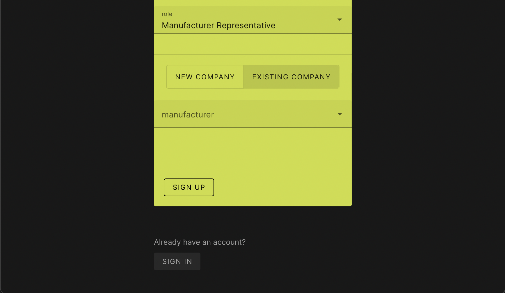
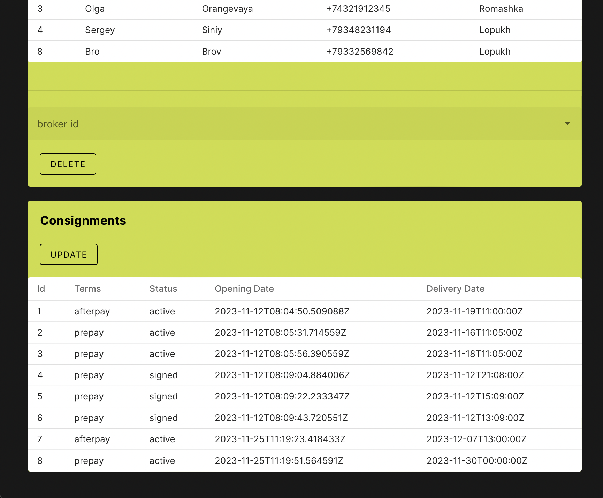

# ЛР 4. Реализация клиентской части средствами Vue.js

 
 

## Описание

В данной лабораторной работе разрабатывается клиентская часть приложения 
для взаимодействия с серверной частью, реализованной в [лабораторной работе №3](3/description.md) 
по варианту 13 - "Товарно-сырьевая биржа".
Выбранный формат приложения - одностраничное приложение в виде дашборда, где компоненты будут меняться в зависимости от роли пользователя.
Предполагается, что приложение будет использоваться тремя категориями пользователей:

- администратор биржи;

- представитель производителя;

- брокер.

 
 

## Страница авторизации

Неавторизованному пользователю доступны только страницы авторизации и регистрации. 
Если неавторизованный пользователь попытается зайти на другие страницы, 
он будет перенаправлен на страницу авторизации.

С этой страницы можно попасть на страницу регистрации.

 
 

## Страница регистрации

В зависимости от выбранной роли пользователю могут быть предложены 
дополнительные поля ввода.  
Для администратора биржи дополнительные данные не требуются.  
Для брокера:

 
Для представителя производителя предлагается 2 варианта - 
выбрать существующего производителя или добавить новую организацию:
 

1)

2) 

 
 

## Главная страница 

После регистрации/авторизации пользователь попадает 
на главную страницу приложения, имеющую формат дашборда с данными биржи
и принимающую различный облик в зависимости 
от роли авторизированного пользователя.
 

#### Администратор биржи
Администратору доступны следующие функции: 

- просмотр списка всех производителей

- удаление выбранного производителя

- просмотр списка всех брокеров

- удаление выбранного брокера

- просмотр списка всех партий, выставленных на бирже

#### Брокер
Брокеру доступны следующие функции: 

- просмотр списка всех доступных товаров

- создание новой партии

- добавление/редактирование товара в партии

- редактирование существующей партии

- просмотр списка всех партий этого брокера

- просмотр списка товаров, входящих в выбранную партию

**все действия с партиями доступны только для партий, 
сформированных текущим авторизированным брокером*

#### Представитель производителя
Представителю производителя доступны следующие функции: 

- создание нового типа товара

- создание нового товара этого производителя

- просмотр списка всех произведенных этим производителем товаров

- просмотр списка всех партий, в которые входят товары этого призводителя

 
 

## Страница редактирования аккаунта

На страницу редактирования аккаунта можно попасть по ссылке в шапке главной страницы.
Поля формы автоматически заполняются данными текущего авторизованного пользователя. 
Аналогично форме регистрации, список полей будет разным для каждой роли пользователей.
По умолчанию поля не доступны для редактирования, 
но при нажатии на кнопку *Edit* они становятся активными.
Внизу страницы есть две кнопки: "Выйти из аккаунта" и "Удалить аккаунт".
После нажатия на каждую из них отображается баннер для повторного подтверждения действия.
  

#### Администратор биржи

#### Брокер

#### Представитель производителя

 
 

## Выводы

В данной лабораторной работе реализована клиентская часть приложения средствами vue.js. 
Реализованы интерфейсы авторизации, регистрации и изменения учётных данных и настроено взаимодействие с серверной частью,
реализованной в лабораторной работе №3 по варианту 13.
Для создания элементов пользовательского интерфейса была подключена и использована библиотека vuetify.
При дизайне UI и UX был сделан упор на наличие минимального достаточного набора функций, адаптивность, 
простоту использования и минималистичность интерфейса. 
